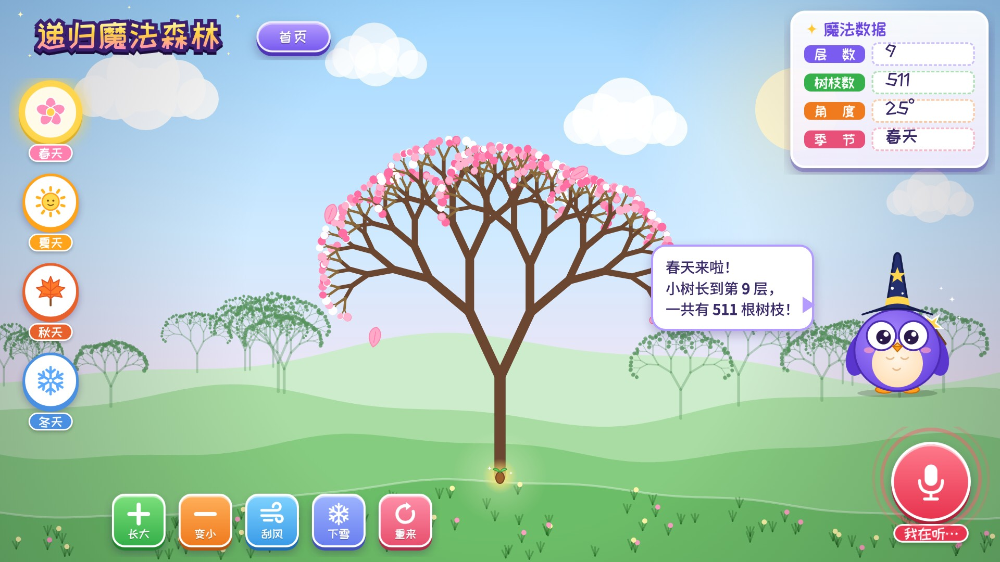
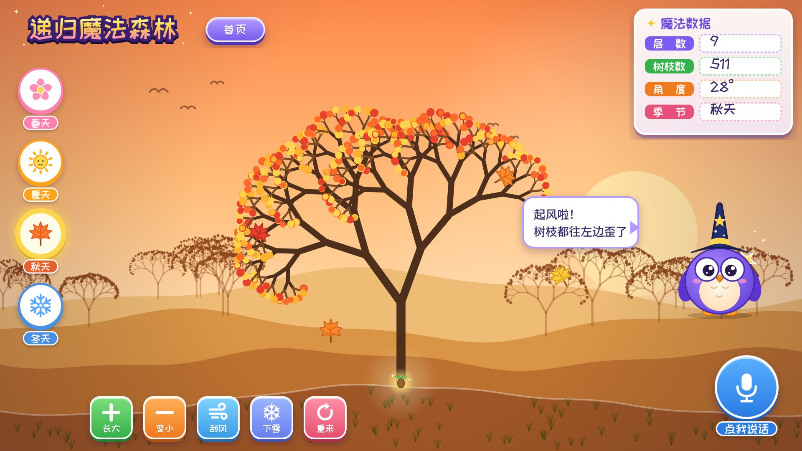
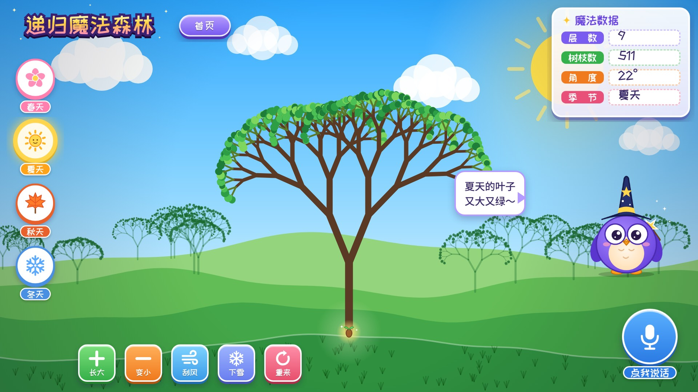
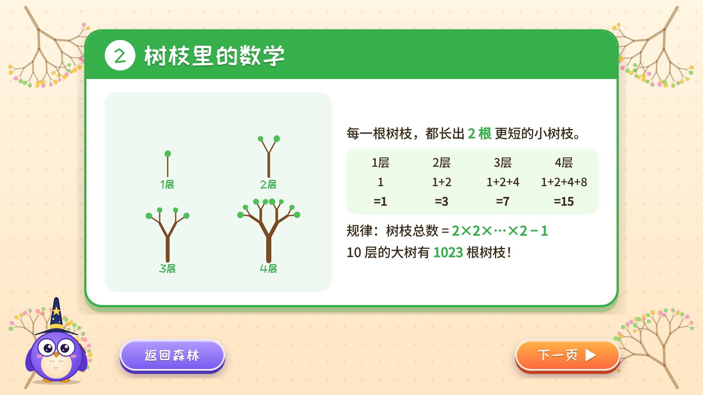

# 《递归魔法森林》制作指南

> 参赛组别：**图形化编程 · 小学高年级组（4-6 年级）**　工具：**Kitten（源码编辑器）**
> 提交时间：**10 月 10 日 – 10 月 18 日**　提交网址：https://contest.codemao.cn/longhua2026

这份指南是写给你（作者）的。素材和思路给你准备好了，**程序要你自己一块块拼出来**。比赛规定作品必须独立完成，而且 10 月 25 日的线下答题里还有一道编程实操题，自己拼过一遍，到时候才答得出来。

---

## 一、作品是什么

一颗魔法种子，加上 **一个会“自己调用自己”的函数**，就能长出一整片森林。

- 🌳 **递归画树**：每根树枝都会分出 2 根更短的小树枝，一层一层地长，最多长到 10 层，一共 1023 根树枝。
- ❄️ **递归画雪花**：每条边都变成 4 条更短的边，画出“科赫雪花”。
- 🎤 **AI 语音魔法**：对着麦克风说“春天”“长大”“刮风”“下雪”，森林马上跟着变；小猫头鹰“递递”会用 AI 朗读，把树枝数念给你听。
- 🔢 **数学看得见**：屏幕右上角的“魔法数据”实时显示层数和树枝数，正好验证 1+2+4+…=2×2×…×2−1 这个规律。
- 📖 **递归小课堂**：用套娃、树枝、雪花三张卡片讲清楚什么是递归。

**和评分标准对应的亮点：**

| 评分项 | 作品里的体现 |
|---|---|
| 创新性 | 小学组很少有人用**递归**；同一个函数换个参数就能变出四季、雪花，“人有我新” |
| 技术性 | 带参数的自定义函数、递归、停止条件、变量、列表、克隆、广播、多屏幕、AI 语音识别和朗读 |
| 艺术性 | 四季背景，分形树本身就是“数学艺术”，原创吉祥物“递递” |
| 思想性 | 结合四年级“角的度量”和找规律，作品本身就能当学习工具 |

---

## 二、做出来是什么样（效果预览）

| 封面 | 春天 | 秋天（刮风） |
|---|---|---|
|  |  |  |
| **夏天** | **冬天（下雪）** | **递归小课堂** |
|  |  |  |

> 预览图里的树都是用**和下面积木一模一样的递归方法**画出来的。你在 Kitten 里拼对了，画出来就是这个样子。

---

## 三、素材清单（`素材/` 文件夹）

### 背景（`素材/backgrounds/`）

| 文件 | 用在哪 |
|---|---|
| 背景_1封面.jpg | 屏幕 1「封面」 |
| 背景_2春 / 3夏 / 4秋 / 5冬.jpg | 屏幕 2「森林」的 4 个背景（随季节切换） |
| 背景_6课堂.jpg | 屏幕 3「课堂」 |

### 角色（`素材/sprites/`）

| 角色名（建议） | 造型文件 | 作用 |
|---|---|---|
| 标题 | 标题_递归魔法森林 | 封面大标题；森林页左上角再放一个小的 |
| 副标题 | 副标题 | 封面 |
| 开始按钮 / 课堂按钮 | 按钮_开始魔法、按钮_递归小课堂 | 封面 |
| 首页按钮 | 按钮_首页 | 森林页回到封面 |
| 春 / 夏 / 秋 / 冬 | 季节_X_1普通、季节_X_2选中 | 每个角色 2 个造型 |
| 长大 / 变小 / 刮风 / 下雪 / 重来 | 按钮_长大 …… | 森林页底部一排 |
| 麦克风 | 麦克风_1等待、麦克风_2正在听 | AI 语音按钮 |
| 数据面板 | 魔法数据面板 | 右上角，变量显示框摆在虚线格子里 |
| 递递 | 递递_1普通、递递_2施法 | 吉祥物，负责说话和朗读 |
| 魔法种子（画笔） | 魔法种子 | **画树和画雪花的就是它**，放在土坡中间的光圈上 |
| 落叶 | 落叶_1红、2橙、3黄 | 秋天飘落（克隆） |
| 花瓣 | 花瓣 | 春天飘落（克隆） |
| 雪粒 | 雪粒 | 冬天飘落（克隆） |
| 卡片 | 课堂卡片_1、2、3 | 课堂页，3 个造型翻页 |
| 返回 / 下一页 | 按钮_返回森林、按钮_下一页 | 课堂页 |

**导入方法：** 角色区点「+」→「本地上传」，选 PNG 图片。同一个角色的第 2 个造型，在「造型」面板里再上传。
导入后图片会比较大，用角色的「大小」属性缩到和预览图差不多（一般 30%~50%）。

> 💡 想更有个人特色的话，可以自己在 Kitten 画板里给递递加一条围巾，或者重画一个按钮，这样作品里也有你自己的美术设计。

---

## 四、屏幕规划

```
屏幕1「封面」 ──开始魔法──▶ 屏幕2「森林」 ◀──返回森林── 屏幕3「课堂」
       └──────递归小课堂──────────────────────────────▶┘
```

**变量（全局）**

| 变量 | 初始值 | 意思 |
|---|---|---|
| 层数 | 8 | 树长几层（1~10） |
| 主干长度 | 100 | 第一根树枝有多长（屏幕小就改成 80） |
| 角度 | 25 | 树枝分叉时转多少度 |
| 风 | 0 | 刮风时变成 12，树会往一边歪 |
| 季节 | 春 | 春 / 夏 / 秋 / 冬 |
| 树枝数 | 0 | 每画一根树枝就加 1 |
| 正在画 | 0 | 画树时是 1，防止重复点按钮 |

**列表**

| 列表 | 内容 |
|---|---|
| 语音口令 | 春天、夏天、秋天、冬天、长大、变小、刮风、下雪、重来 |

---

## 五、核心程序（最重要！）

下面的“积木”是按 Kitten 的积木写的。缩进表示积木嵌在里面。
不同版本的 Kitten 积木名字可能略有不同（比如“左转”有的版本叫“旋转 −15 度”），找意思一样的就行。

### 5.1 魔法种子：递归画树 ⭐ 作品的心脏

在「函数」分类里新建函数 **画树枝**，加两个参数：**长度**、**层**。

```
定义函数 画树枝（长度）（层）
    如果 〈 层 = 0 〉 那么                       ← 停止条件：最细的地方画叶子
        调用 画叶子
    否则
        树枝数 增加 1
        设置画笔粗细为 （层 × 1.2）               ← 越往上越细
        如果 〈 层 > 2 〉 那么 设置画笔颜色为 [深棕色]
        否则 设置画笔颜色为 [浅棕/季节色]
        落笔
        移动 （长度） 步                          ← 画出这一根树枝
        左转 （角度 + 风） 度
        调用 画树枝 （长度 × 随机数(0.68~0.78)）（层 − 1）   ← 自己调用自己①
        右转 （角度 × 2） 度
        调用 画树枝 （长度 × 随机数(0.68~0.78)）（层 − 1）   ← 自己调用自己②
        左转 （角度 − 风） 度                     ← 转回原来的方向
        抬笔
        移动 （0 − 长度） 步                      ← 退回树枝根部
```

**为什么最后要“转回来、退回去”？**
每次画完一根树枝和它上面的所有小树枝，种子都必须**回到出发时的位置和方向**，不然下一根树枝就会从错的地方长出来。
算一算转了多少度：左转 (角度+风)，右转 2×角度，左转 (角度−风)，加起来正好是 0 度。

> ✅ 自测：先把层数设成 **1**，应该只画出一根竖线；**2** 层是一个 “Y”；**3** 层是两个小 “Y”。都对了，再慢慢加到 8、9、10。

```
定义函数 画叶子
    设置画笔粗细为 （随机数 10 ~ 16）
    如果 季节 = 春 → 在 粉色 / 白色 里随机选一个当画笔颜色
    如果 季节 = 夏 → 在 深绿 / 浅绿 里随机选
    如果 季节 = 秋 → 在 红 / 橙 / 黄 里随机选
    如果 季节 = 冬 → 画笔颜色 白色，粗细改成 6     ← 树梢上的积雪
    落笔
    移动 1 步
    移动 -1 步                                    ← 原地点一个圆点 = 一片叶子
    抬笔
```

```
定义函数 长一棵树
    正在画 设为 1
    清除所有画笔
    树枝数 设为 0
    移到 种子的位置（土坡中间的光圈）
    面向 上方                                      ← Kitten 里先试“面向 90 度”或“面向 0 度”，哪个朝上用哪个
    调用 画树枝 （主干长度）（层数）
    正在画 设为 0
    广播 “树长好了”
```

> 画得慢没关系，看着树一层层长出来就是魔法动画。如果嫌太慢，可以先把层数调小。

### 5.2 魔法种子：递归画雪花 ❄️

```
定义函数 雪花边（长度）（层）
    如果 〈 层 = 0 〉 那么
        移动 （长度） 步                           ← 停止条件：直接画直线
    否则
        调用 雪花边 （长度 ÷ 3）（层 − 1）
        左转 60 度
        调用 雪花边 （长度 ÷ 3）（层 − 1）
        右转 120 度
        调用 雪花边 （长度 ÷ 3）（层 − 1）
        左转 60 度
        调用 雪花边 （长度 ÷ 3）（层 − 1）

定义函数 画雪花（大小）（层）
    设置画笔颜色为 白色，粗细 2
    面向 右边
    落笔
    重复执行 3 次
        调用 雪花边 （大小）（层）
        右转 120 度
    抬笔

当收到广播 “下雪”
    重复执行 5 次
        移到 x：随机数（左边~右边）  y：随机数（天空的高度范围）
        调用 画雪花 （随机数 30~70）（随机数 1~3）
    移到 种子的位置
```

### 5.3 季节按钮（春夏秋冬 4 个角色，程序几乎一样）

```
当 角色被点击
    如果 正在画 = 1 → 停止这个脚本
    季节 设为 春
    广播 “换季”

当收到广播 “换季”
    如果 季节 = 春 → 切换到造型 “季节_春_2选中”
    否则 → 切换到造型 “季节_春_1普通”
```

舞台（屏幕 2）：
```
当收到广播 “换季”
    如果 季节 = 春 → 切换背景到 背景_2春        （夏、秋、冬同理）
    广播 “长树”
```

魔法种子：
```
当收到广播 “长树”  →  调用 长一棵树
```

### 5.4 下面一排按钮

| 按钮 | 被点击时 |
|---|---|
| 长大 | 如果 层数 < 10 → 层数 增加 1，广播“长树” |
| 变小 | 如果 层数 > 1 → 层数 增加 −1，广播“长树” |
| 刮风 | 如果 风 = 0 → 风 设为 12，否则 风 设为 0；广播“长树” |
| 下雪 | 季节 设为 冬，广播“换季”，等到树长好后再广播“下雪” |
| 重来 | 层数 设为 8，风 设为 0，广播“长树” |

**按钮的小动画（每个按钮都加上，看起来更灵动）：**
```
当 角色被点击
    设置大小为 （原来的大小 × 0.9）
    等待 0.1 秒
    设置大小为 原来的大小
```

### 5.5 🎤 AI 语音魔法（麦克风角色）

先在积木区底部的「扩展/AI」里添加 **语音识别** 和 **文字朗读**。

```
当 角色被点击
    切换到造型 “麦克风_2正在听”
    开始语音识别（中文），时长 3 秒
    切换到造型 “麦克风_1等待”
    广播 “听到了”

当收到广播 “听到了”
    如果 语音识别结果 包含 “春” → 季节 设为 春，广播 “换季”
    如果 语音识别结果 包含 “夏” → 季节 设为 夏，广播 “换季”
    如果 语音识别结果 包含 “秋” → 季节 设为 秋，广播 “换季”
    如果 语音识别结果 包含 “冬” → 季节 设为 冬，广播 “换季”
    如果 语音识别结果 包含 “长大” → （和“长大”按钮一样）
    如果 语音识别结果 包含 “小”   → （和“变小”按钮一样）
    如果 语音识别结果 包含 “风”   → （和“刮风”按钮一样）
    如果 语音识别结果 包含 “雪”   → （和“下雪”按钮一样）
    如果 语音识别结果 包含 “重来” → （和“重来”按钮一样）
    如果 一个都没听懂 → 让递递说 “我没听清，再说一次吧～”
```

> 小技巧：用“包含”比用“等于”好，因为识别结果可能是“春天！”“我要春天”这样的句子。

### 5.6 递递：会说话的数学小老师

```
当收到广播 “树长好了”
    切换到造型 “递递_2施法”
    说 （ 合并 “这棵树有 ” 层数 “ 层，一共 ” 树枝数 “ 根树枝！” ） 3 秒
    朗读 （同样的话）
    切换到造型 “递递_1普通”
```

**加分小彩蛋：** 让递递验算规律。
```
    算一算：2 × 2 × … × 2（层数个 2）− 1
    （用一个变量“验算”，重复执行 层数 次：验算 = 验算 × 2；最后减 1）
    如果 验算 = 树枝数 → 说 “和数学规律一模一样！”
```
这一段能证明程序里数出来的树枝数和数学公式算出来的结果完全一样，很适合在视频里展示。

### 5.7 飘落效果（克隆）

以“落叶”为例，花瓣、雪粒同理：
```
当收到广播 “换季”
    如果 季节 = 秋
        重复执行 15 次
            克隆 自己
            等待 0.3 秒

当作为克隆体启动时
    切换到造型 随机数(1~3)               ← 红、橙、黄随机
    移到 x：随机数（左~右）  y：屏幕顶部
    显示
    重复执行直到 〈 y < 地面高度 〉
        y 增加 −3
        x 增加 随机数(−2~2)
        旋转 4 度
    删除自己
```
本体记得一开始就 **隐藏**。

### 5.8 屏幕切换和课堂

```
开始魔法按钮：当被点击 → 切换到屏幕 “森林”
递归小课堂按钮：当被点击 → 切换到屏幕 “课堂”
首页按钮：当被点击 → 切换到屏幕 “封面”

卡片角色（3 个造型）：
    当屏幕切换到“课堂”时 → 切换到造型 1
下一页：当被点击 → 卡片 下一个造型
返回森林：当被点击 → 切换到屏幕 “森林”
```

### 5.9 开场

```
当 ▶ 开始 被点击（森林屏幕）
    层数 设为 8，主干长度 设为 100，角度 设为 25，风 设为 0
    季节 设为 春
    广播 “换季”
```

**数据面板：** 在变量列表里勾选 层数、树枝数、角度、季节，让它们显示在舞台上，再拖到面板的虚线格子里。

---

## 六、调试小妙招

1. **树往下长 / 往旁边长**：改“面向”的角度（试试 0、90、−90）。
2. **树歪了收不回来**：检查最后的“左转 (角度 − 风)”和“移动 (0 − 长度)”有没有漏掉。
3. **画面被树撑出去**：把主干长度改小，或者把层数调小。
4. **退回去时留下了线**：退回之前一定要先“抬笔”。
5. 每做完一个功能就**保存一次**，文件名带上日期，比如“递归魔法森林_1008”。

---

## 七、时间安排（今天 10/6 → 截止 10/18）

| 日期 | 任务 | 完成标准 |
|---|---|---|
| 10/6 | 看“递归小课堂”卡片，搞懂套娃和停止条件；导入素材，搭好 3 个屏幕 | 能在 3 个屏幕间点来点去 |
| 10/7 | **画树枝函数**（5.1），从 1 层测到 8 层 | 画出一棵完整的树 ✅ |
| 10/8 | 画叶子、四季按钮、切换背景 | 点四季能换树 |
| 10/9 | 长大 / 变小 / 刮风 / 重来按钮 + 数据面板 | 数字跟着变 |
| 10/10 | 🎤 语音识别 + 递递朗读 | 说“秋天”树会变 |
| 10/11 | 雪花函数（5.2）+ 飘落克隆 | 冬天下雪 |
| 10/12 | 课堂页 + 递递验算彩蛋 + 按钮动画 | 全部功能齐全 |
| 10/13 | 让家人试玩，找 bug，给积木加**注释** | 没有报错 |
| 10/14 | 写作品说明文档（第八节） | 文档完成 |
| 10/15 | 录讲解视频（第九节） | 5 分钟以内 |
| 10/16 | **提交**（不要拖到最后一天） | 已提交 ✅ |
| 10/17–24 | 复习积木知识，准备 10/25 线下答题 | |

**给积木加注释**（评分标准里有“源代码注释规范”）：在 Kitten 里右键积木 →「添加注释」。至少给这些地方写上注释：停止条件、两次调用自己、转回原方向、退回根部、语音判断。

---

## 八、作品说明文档框架

> 命名：`学校名称-作者姓名-递归魔法森林`

1. **设计意图**：数学课学了“角”和“找规律”，发现大树的树枝、雪花的形状里藏着规律：大的里面套着小的。我想用编程把这个规律变成魔法。
2. **作品功能**：四季魔法树、语音魔法、下雪、刮风、魔法数据、递归小课堂（每项配一张截图）。
3. **制作工具与素材**：Kitten 源码编辑器；AI 语音识别和朗读；素材清单。
4. **技术实现过程**：
   - 递归函数“画树枝”的流程图：停止条件 → 画一根 → 左边调用自己 → 右边调用自己 → 回到原位；
   - 树枝数的规律表（1, 3, 7, 15 …… 2×2×…×2−1）；
   - 科赫雪花（3, 12, 48, 192 条边）；
   - 语音口令是怎么判断的。
5. **遇到的问题和解决办法**：例如“树越画越歪”是因为忘了转回来；“退回时多出一条线”是因为没抬笔。
6. **制作反思**：一个很短的函数能画出上千根树枝，这就是递归的力量。下一步想做……（比如加入手势识别、做一片有很多棵树的森林）。

---

## 九、5 分钟讲解视频脚本（参考）

| 时间 | 画面 | 说什么 |
|---|---|---|
| 0:00–0:30 | 封面 | 自我介绍 + “你知道一棵大树里藏着什么数学秘密吗？” |
| 0:30–1:30 | 课堂 3 张卡片 | 用套娃讲递归的两个法宝 |
| 1:30–2:30 | 森林：层数从 1 点到 9 | 树一层层长出来，指着面板说：1、3、7、15……递递验算“和数学规律一模一样” |
| 2:30–3:30 | 对麦克风说：春天→秋天→刮风→下雪 | 展示 AI 语音魔法和四季变化 |
| 3:30–4:30 | 切到 Kitten 代码 | 讲“画树枝”函数：停止条件、两次调用自己、为什么要转回来 |
| 4:30–5:00 | 冬天雪景 | 收获和感想 |

录屏可以用电脑自带的录屏功能，旁白自己配音。视频不超过 5 分钟、不超过 200MB。

---

## 十、10/25 线下答题小提醒

线下答题限时 60 分钟：单选、多选、填空各 10 道，外加 1 道编程实操题。实操题很可能考**画笔 + 重复执行 + 函数**，把这个作品吃透就是最好的复习。可以多练练：
- 用“重复执行”画正方形、正三角形、五角星（外角 = 360 ÷ 边数，五角星每次转 144 度）；
- 带参数的函数（画任意大小的正多边形）；
- 变量、列表、广播、克隆的基本用法。
